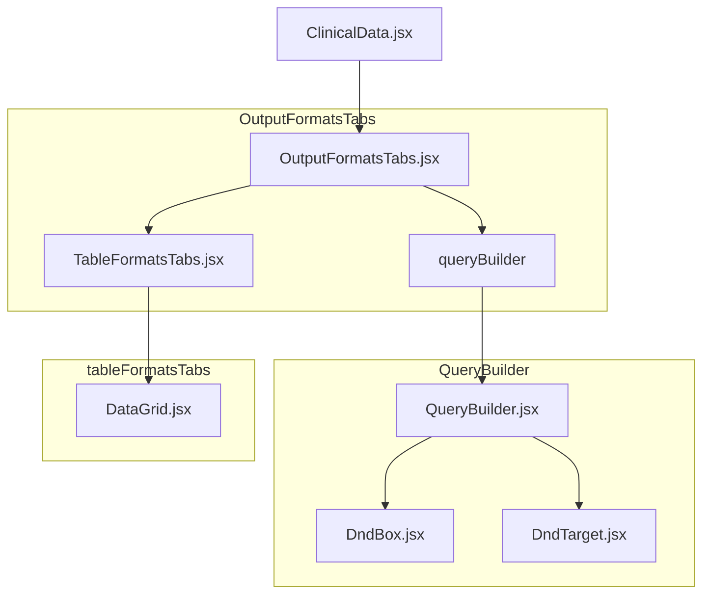

The clinical data component

```mermaid
graph TB
  A[ClinicalData.jsx]
  B[OutputFormatsTabs.jsx]
    A --> B

    subgraph OutputFormatsTabs
        C[queryBuilder]
        D[TableFormatsTabs.jsx]
        B --> C
        B --> D
    end

        subgraph QueryBuilder
            E[QueryBuilder.jsx]
            F[DndBox.jsx]
            G[DndTarget.jsx]
            C --> E
            E --> F
            E --> G
        end

        subgraph tableFormatsTabs
            H[DataGrid.jsx]
            D --> H
        end
```
