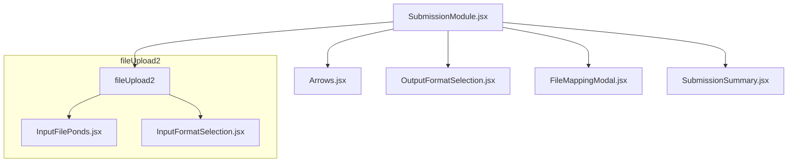

The submsission component

```mermaid
graph TB
  A[SubmissionModule.jsx]
  B[Arrows.jsx]
  C[fileUpload2]
  D[OutputFormatSelection.jsx]
  E[FileMappingModal.jsx]
  F[SubmissionSummary.jsx]
    A --> B
    A --> C
    A --> D
    A --> E
    A --> F

    subgraph fileUpload2
        G[InputFilePonds.jsx]
        H[InputFormatSelection.jsx]
        C --> G
        C --> H
    end
```
