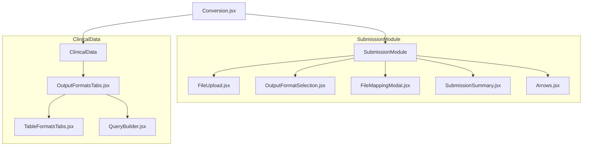

The conversion view

```mermaid
graph TB
  A[Conversion.jsx]
  B[SubmissionModule]
  C[ClinicalData]
    A --> B
    A --> C

    subgraph SubmissionModule
        D[FileUpload.jsx]
        E[OutputFormatSelection.jsx]
        F[FileMappingModal.jsx]
        G[SubmissionSummary.jsx]
        H[Arrows.jsx]
        B --> D
        B --> E
        B --> F
        B --> G
        B --> H
    end

    subgraph ClinicalData
        I[OutputFormatsTabs.jsx]
        J[TableFormatsTabs.jsx]
        K[QueryBuilder.jsx]
        C --> I
        I --> J
        I --> K
    end
```
