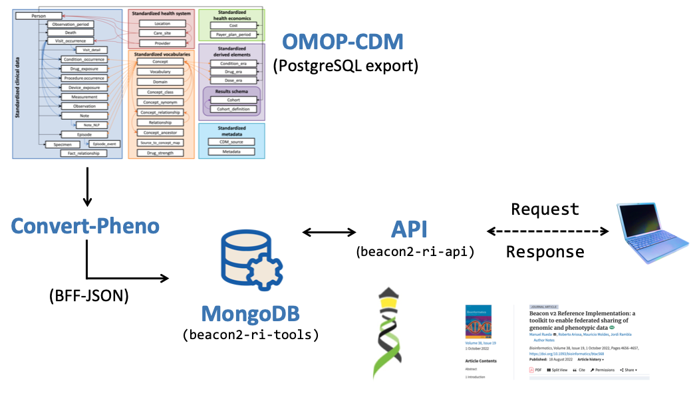

Frequently Asked Questions

## General

??? faq "What does `Convert-Pheno-UI` do?"

    This tool facilitates the conversion of clinical data between commonly used formats, such as [GA4GH standards](https://www.ga4gh.org), to enable **secure data sharing** and discovery through **semantic interoperability**.

    ##### last change 2023-22-06 by Ivo Leist [:fontawesome-brands-github:](https://github.com/ivoleist)

??? faq "Can I use `Convert-Pheno-UI` in _production_ software?"

    Nope. We're working on it as we speak.

    ##### last change 2023-22-06 by Ivo Leist [:fontawesome-brands-github:](https://github.com/ivoleist)

??? faq "If I use `Convert-Pheno-UI` to convert my data to [Beacon v2 Models](bff.md), does this mean I have a Beacon v2?"

    I am afraid not. Beacon v2 is an [API specification](https://docs.genomebeacons.org), and the [Beacon v2 Models](bff.md) are merely a component of it. In order to _light a Beacon v2_, it is necessary to load the `JSON` files into a **database** and add an an **API** on top. Currently, it is advisable to utilize the [Beacon v2 Reference Implementation](https://b2ri-documentation.readthedocs.io/en/latest) which includes the database, the Beacon v2 API, and other necessary components.

    See below an example in how to integrate an OMOP-CDM export from SQL with Beacon v2.

    <figure markdown>
      { width="600" }
      <figcaption>Beacon v2 RI integration</figcaption>
    </figure>

    ##### last change 2023-06-20 by Manuel Rueda [:fontawesome-brands-github:](https://github.com/ivoleist)

??? faq "What is the difference between Beacon v2 Models and Beacon v2?"

    **Beacon v2** is a specification to build an [API](https://docs.genomebeacons.org). The [Beacon v2 Models](https://docs.genomebeacons.org/models/) define the format for the API's responses to queries regarding biological data. With the help of `Convert-Pheno`, text files ([BFF](bff.md)) that align with this response format can be generated. By doing so, the BFF files can be integrated into a non-SQL database, such as MongoDB, without the API having to perform any additional data transformations internally.

    ##### last change 2023-02-13 by Manuel Rueda [:fontawesome-brands-github:](https://github.com/ivoleist)

??? faq "Are you planning in supporting other clinical data formats?"

    Afirmative. Please check our [roadmap](future-plans.md) for more information.

    ##### last change 2023-22-06 by Ivo Leist [:fontawesome-brands-github:](https://github.com/ivoleist)

??? faq "Which ontologies are supported?"

    If the input files contain ontologies, the ontologies will be preserved and remain intact after the conversion process, except for:

    * _Beacon v2 Models_ and _Phenopackets v2_: the property `sex` is converted to [NCI Thesaurust](https://ncithesaurus.nci.nih.gov/ncitbrowser).
    * _OMOP-CDM_: the properties `sex`, `ethnicity`, and `geographicOrigin` are converted to [NCI Thesaurus](https://ncithesaurus.nci.nih.gov/ncitbrowser).

    <!-- checkmarks are not visible in darkmode !

    |                | REDCap      | CDISC-ODM  | OMOP-CDM | Phenopackets v2| Beacon v2 Models |
    | -----------    | ----------- | ---------- | -------  | -------------- | -----------------|
    | Data mapping   | :heavy_check_mark: |  :heavy_check_mark: | :heavy_check_mark: | :heavy_check_mark: | :heavy_check_mark: |
    | Add ontologies | :heavy_check_mark: |  :heavy_check_mark: | `--ohdsi-db` |     |                  |

    For _REDCap_ and _CDISC-ODM_ we support:

    * [NCI Thesaurus](https://ncithesaurus.nci.nih.gov/ncitbrowser)
    * [ICD-10](https://icd.who.int/browse10)
    * [CDISC](https://www.cdisc.org/standards/terminology/controlled-terminology) (Study Data Tabulation Model Terminology)
    * [Athena-OHDSI](https://athena.ohdsi.org/search-terms/start) which includes multiple ontologies, such as _SNOMED, RxNorm or LOINC_

    ##### last change 2023-03-28 by Manuel Rueda [:fontawesome-brands-github:](https://github.com/ivoleist)

??? faq "Are longitudinal data supported?"

    Although Beacon v2 and Phenopackets v2 allow for storing time information in some properties, there is currently no way to associate medical visits to properties. To address this:

    * `omop2bff` -  we added an _ad hoc_ property (**_visit**) to store medical visit information for longitudinal events in variables that have it (e.g., measures, observations, etc.).

    * `redcap2bff` - In REDCap, visit/event information is not stored at the record level. We added this information inside `info` property.

    We raised this issue to the respective communities in the hope of a more permanent solution.

    ##### last change 2023-03-24 by Manuel Rueda [:fontawesome-brands-github:](https://github.com/ivoleist)

??? faq "How are variables that cannot be mapped handled during the conversion process?"

    When converting between different data standards, it is common to encounter situations where some variables cannot be directly mapped to their equivalent in the target standard. In such cases, the original variable is typically stored under the `info` property in the converted file. While Beacon v2 has a flexible schema that allows for this, Phenopackets v2 schema is more restrictive in this regard.

    ##### last change 2023-03-25 by Manuel Rueda [:fontawesome-brands-github:](https://github.com/ivoleist)

## Installation

??? faq "I have troubles to self-host `Convert-Pheno-UI`"

    We feel you. It can be indeed quite daunting sometimes to make an application working which comprises
    of multiple microservices. Make sure that you were following the [instructions](https://github.com/CNAG-Biomedical-Informatics/convert-pheno-ui/blob/main/dev_docs/how_to_self_host_w_keycloak_login_enabled.md) carefully.
    If you still have troubles, please [open an issue](https://github.com/CNAG-Biomedical-Informatics/convert-pheno-ui/issues/new) and we will try to help you.

    ##### last change 2023-22-06 by Ivo Leist [:fontawesome-brands-github:](https://github.com/ivoleist)
