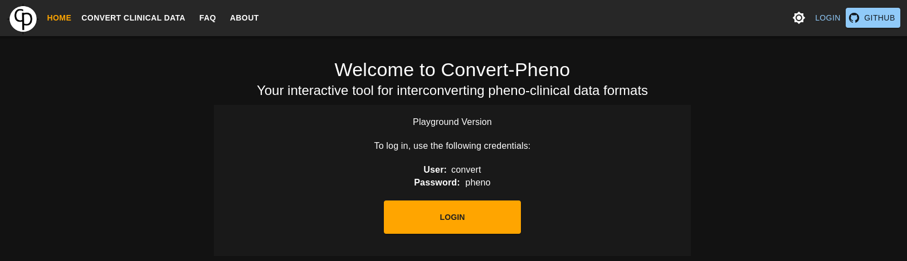

If you want to try `Convert-Pheno-UI` out we are providing a [playground](https://convert-pheno.cnag.cat/)

In order to access there is no need to register, just use the following credentials:

- username: `convert`
- password: `pheno`

!!! Warning "Use"
    The playground has only one user so all the files uploaded will be visible to everyone.
    So please do not upload any sensitive data.

<figure markdown>
 
</figure>
