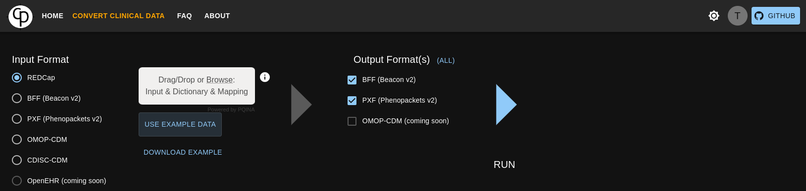
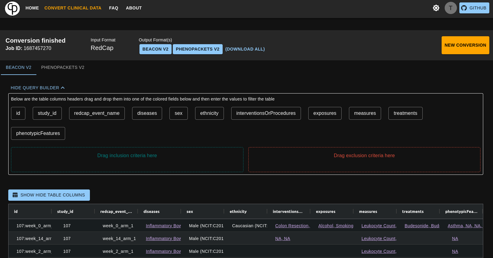

=== "Convert clinical data"
	After being logged in with the user `convert` and password `pheno`
	you will be redirected to the conversion page.

	A conversion is a 4-step process:

	1. Select the input format
	2. Upload the necessary input files OR
	click on the `example` button to use the example files provided by us
	3. Select one or multiple output formats
	4. Click on the `RUN` button

	!!! Tip "Hint"
		Mouse over the `i` icon to get more information which files and formats are required for the selected input format.

	!!! Warning "Use"
		The playground has only one user so all the files uploaded will be visible to everyone.
		So please do not upload any sensitive data.

	<figure markdown>
	
	<figcaption> Use example data selected</figcaption>
	</figure>

=== "Explore the results"
	After the conversion is finished you will be redirected to the results page. Where you can:

	 - Download the results
	 - Explore the results in the table (hide the columns you are not interested in)
	 - Filter the results with the query builder

	<!-- below should be a gif
	<figure markdown>
	
	</figure>
