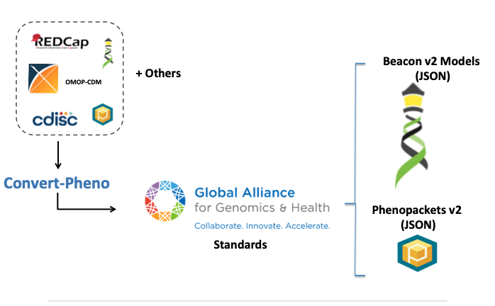

# What is Convert-Pheno-UI?

is a web-interface for [`Convert-Pheno`](https://cnag-biomedical-informatics.github.io/convert-pheno/), a software toolkit for the interconversion of standard data models for phenotypic data.

<figure markdown>
 {width="500"}
 <figcaption>Convert-Pheno schematic view</figcaption>
</figure>

<!-- add a gif -->

!!! Tip "Use"

    `Convert-Pheno-UI` can be accessed in three ways:

    * [Playground](use-the-playground.md)
    * [Playground-API](use-as-an-api.md)
    * [Run locally](use-as-an-api.md)
